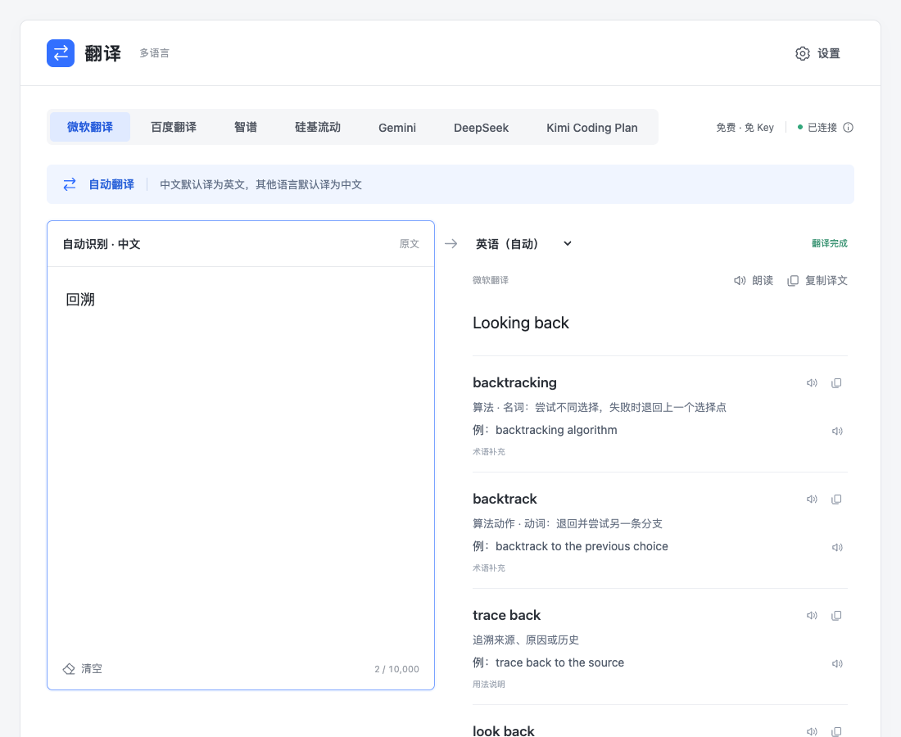
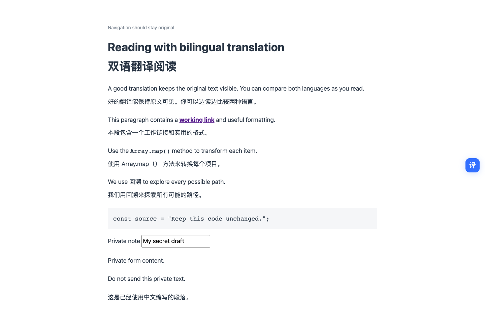
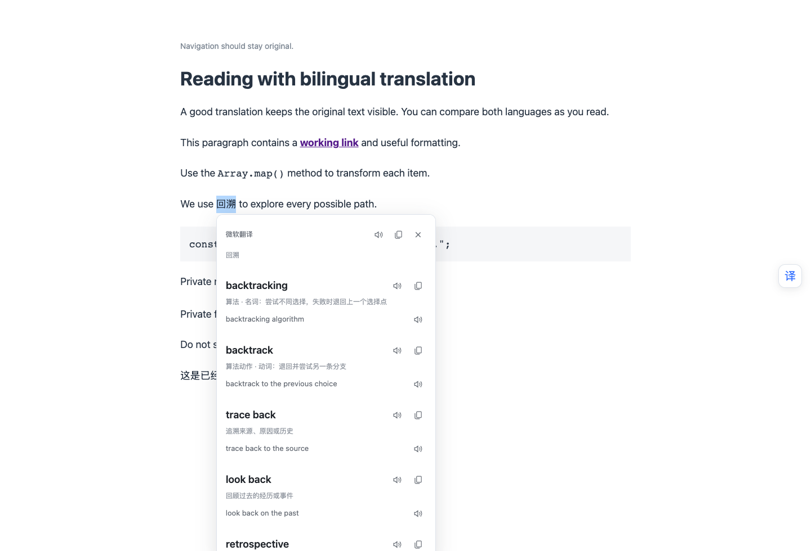

# Chrome Translate · 翻译

[](https://github.com/ALVIN-YANG/chrome-translate/actions/workflows/check.yml)
[](https://github.com/ALVIN-YANG/chrome-translate/releases/latest)

一个支持 **网页双语、划词和独立文本翻译** 的 Chrome 扩展。支持 **15 种语言、7 个服务**；保留网页原文，查词可比较词义，译文与例句可复制或朗读。

**[下载最新插件包](https://github.com/ALVIN-YANG/chrome-translate/releases/latest)** · [安装](#安装) · [翻译服务](#翻译服务) · [反馈问题](https://github.com/ALVIN-YANG/chrome-translate/issues)

[](docs/assets/preview.png)

*截图来自实际运行的 v0.5.0，使用微软翻译和必应词典；点击图片可查看大图。*

## 网页双语与划词

点击工具栏图标，在菜单里选择 **「翻译当前网页」**，译文会显示在原文下方。也可以点击网页右侧的 **「译」**、使用右键菜单，或按 **Alt+A**。再次点击或按相同快捷键，恢复原文。开启方式参考[沉浸式翻译的使用文档](https://immersivetranslate.com/zh-Hans/docs/usage/)，本项目与该产品没有关联。

默认优先处理文章、正文区域，跳过导航和侧栏；先翻译视口附近的段落，滚动时继续，动态增加或修改的文字也会处理。需要扩大范围时，在工具栏选择 **「翻译整个页面」**，或按 **Alt+W**。整页模式仍跳过代码块、独立代码、表单、输入框、可编辑区域及标记为不翻译的内容。链接、原有格式和点击事件保留。

选中文字后，旁边会出现小 **「译」** 按钮，点击后打开划词浮层；也可右键选择 **「翻译选中文字」**。中文自动译英文，其他语言译中文。短词展示不同译法与语境，句段展示一份译文；每项译文可复制或朗读，例句带小喇叭。按 **Esc** 或点击浮层外关闭。仅选中文字不会发送翻译请求。

工具栏可选择服务、网页目标语言，以及开关划词按钮、网页右侧按钮。默认网页译为中文；更改服务或目标语言会恢复原文，需要再次主动开启翻译，不会自动把已打开的网页转发给另一家服务。刷新或跳转到新网页后，需要重新开启；当前页面的译文缓存只放在内存中，关闭后再次开启可复用。

快捷键与其他扩展冲突时，可在 `chrome://extensions/shortcuts` 修改。macOS 的 Alt 对应 Option。此版本支持普通 HTTP/HTTPS 网页的文本；不包含 PDF、图片、视频字幕翻译，也不读取子框架或网站的 Shadow DOM。浏览器内置页、Chrome 插件市场和本地文件不能注入，工具栏会给出提示。

[](docs/assets/webpage.png)

[](docs/assets/selection.png)

## 独立文本翻译

- **翻译文本**：原文自动识别，词语与句段自动判断。默认中文译英文，其他语言译中文，也可以指定目标语言。
- **分清词义**：例如「回溯」可参考算法名词 `backtracking`、动词 `backtrack`，以及追溯来源的 `trace back`。词义按同一层级展示，有语境的候选优先；默认译法不再占据独立大标题。
- **听译文和例句**：译文、候选词、例句都能单独朗读。英文例句使用英文声音，翻译成中文后也一样。
- **直接复制**：结果是可选中的普通文本；每个词义可单独复制，多义词还可一键复制全部译法。完整句段可一次复制全文。

结果使用无框的连续阅读布局，长内容随页面展开。输入变化后立即翻译，中文输入法选字期间不发请求；新输入会取消旧请求，迟到的结果不会覆盖当前内容。更新或失败时保留上次结果，并标明旧结果的语言和状态，仍可选中、复制或朗读；新结果完成后一次替换。

工具栏菜单里的「打开独立翻译页」会优先激活已经打开的翻译页。当前标签页会暂存原文、服务选择、目标语言和已有结果，刷新可恢复；匹配的结果不重复请求接口。清空后有 8 秒可以点击「撤销清空」。

## 安装

适用于 **Chrome 120 或更新版本**。安装 Release 插件包不需要 Node.js，也不需要注册开发者账号。

1. 在 [Releases](https://github.com/ALVIN-YANG/chrome-translate/releases/latest) 下载 **`translate-chrome-*.zip`**。
2. 将安装包解压到一个固定文件夹。
3. 打开 `chrome://extensions`，开启右上角「开发者模式」。
4. 点击「加载已解压的扩展程序」，选择**直接包含 `manifest.json` 的那个文件夹**。
5. 点击工具栏里的「翻译 · 多语言」图标，选择「翻译当前网页」，或选择「打开独立翻译页」后粘贴文本。默认使用微软翻译，无需填写 Key。

> 「Code → Download ZIP」下载的是源码，需先构建。安装请使用 Releases 中的 `translate-chrome-*.zip`，不要选 `Source code`。

更新时，用新版安装包替换原文件夹内容，在扩展管理页面点击「重新加载」，再刷新翻译页及需要翻译的网页，使新版网页脚本生效。加载后保留该文件夹，避免移动或删除它。

## 翻译服务

在右上角「设置」填写凭据，可用「测试连接」检查配置。七个服务手动切换，失败时不会自动把文本转发给另一个服务。

| 服务 | 需要配置 | 提供什么 |
| --- | --- | --- |
| 微软翻译 | 无需 Key | 即时文本翻译；中英短词可补充必应词义 |
| 百度翻译 | APP ID、密钥 | 官方通用文本翻译，返回主译文 |
| 智谱 | 普通 API Key | 免费模型 `glm-4.7-flash`；文本翻译、词义候选及例句 |
| 硅基流动 | API Key | 免费模型 `tencent/Hunyuan-MT-7B`；专门翻译文本，返回主译文 |
| Gemini | Google AI Studio Key | `gemini-3.1-flash-lite` 有免费层；文本翻译、词义候选及例句 |
| DeepSeek | API Key、模型 | 文本翻译；短词可返回不同译法、语境及例句 |
| Kimi Coding Plan | Coding Plan Key、模型 | 文本翻译与词义候选；仅接入 Coding Plan |

DeepSeek 当前默认模型为 `deepseek-flash`，Kimi 当前默认模型为 `kimi-for-coding`，均可在设置中修改。服务额度、费用和账号权限由对应服务商决定，仓库与安装包不包含任何真实 Key。

新增的智谱、硅基流动、Gemini 固定使用表中模型，只需填写 Key。「免费模型」仍需注册账号，且可能限流；Gemini 免费层有地区与配额限制，付费项目使用同一模型可能收费。Gemini 免费层的内容可能用于改进 Google 产品，请勿输入敏感文本。免费政策核查于 2026-10-09，后续以厂商为准。选型依据、申请入口和来源见 [免费模型说明](docs/免费模型说明.md)。

微软使用 Edge 的免 Key 翻译接口，接口可能限流或变更，未公开承诺第三方使用的长期稳定性。Kimi Code 官方面向个人编程场景，通用翻译用途与账号许可是否匹配需按服务商规则确认；遇到权限拒绝会直接提示，不伪装客户端。

## 支持的语言

中文、英语、日语、韩语、法语、德语、西班牙语、葡萄牙语、俄语、意大利语、阿拉伯语、印地语、泰语、越南语、印尼语。

原文始终由所选服务自动识别，只保留目标语言选择。短文本可能有歧义，可指定目标语言或补充上下文。阿拉伯语结果支持从右向左阅读。

## 词义与朗读

微软的额外词义来自必应中英词典，少量算法术语另有带来源的用法补充。其他语言不会混入中英词典结果；智谱、Gemini、DeepSeek、Kimi 的候选由模型生成，百度和硅基流动的混元翻译只返回主译文。完整句段通常显示一份译文，没有可靠候选时不强行凑数。

例句优先使用目标语言，中文释义另起一行；纯中文内容不会被当作英文例句展示。短词自动判断和模型输出都可能不准确，使用时结合上下文。

朗读使用设备已安装的系统声音，无需语音接口或额外 Key。点击小喇叭开始，再点停止；修改输入、切换服务或清空时停止旧朗读。**支持某种翻译语言，不代表设备已安装对应声音**，缺少声音时会提示，复制仍可使用。

## 数据与权限

- 原文发送给当前选择的翻译服务；微软中英短词查询还会访问必应词典。网页只有主动开启翻译后才发送待翻译段落，划词只有点击翻译按钮或右键翻译时才发送选中文字；不会把网页 URL、Cookie 或整份 HTML 发送给翻译服务。
- Key 和服务偏好保存在 `chrome.storage.local`，不通过浏览器同步到云端。存储仅允许扩展可信上下文读取，网页内容脚本只收到服务是否已配置及非敏感偏好，不能读取 Key；请求由扩展后台发送。
- 当前标签页的原文、服务选择、目标语言及结果暂存于 `sessionStorage`，不包含 Key，也不建立历史记录；会话由浏览器管理，浏览器的恢复标签页功能可能恢复该会话。
- 没有自建中转后端、统计 SDK 或远程脚本；各服务请求通过 HTTPS 发送。网页译文使用纯文本和隔离样式插入，不执行服务返回的 HTML。
- 请求本地存储、右键菜单，以及普通 HTTP/HTTPS 网页的访问权限。网页权限用于显示划词按钮、读取待翻译文本和插入双语译文，也覆盖翻译服务的 HTTPS 请求；不请求 `tabs`、剪贴板读取或麦克风权限。系统朗读只选择设备本地声音。

源码可查看各项数据处理逻辑：[网页提取](src/page-segments.js)、[双语翻译](src/page-translation.js)、[后台消息与凭据](src/background.js)、[配置保存](src/settings.js)、[翻译请求](src/providers.js)、[词典查询](src/dictionary.js)、[系统朗读](src/speech.js)。

## 开发

需要 Node.js 20 或更新版本。

```sh
git clone https://github.com/ALVIN-YANG/chrome-translate.git
cd chrome-translate
npm ci
npm run check
```

检查通过后，将生成的 `dist/` 文件夹加载到 Chrome。

主分支更新和 Pull Request 会在 [GitHub Actions](https://github.com/ALVIN-YANG/chrome-translate/actions/workflows/check.yml) 自动运行同一套测试与构建，分别检查 Node.js 20 和 24。成功后保留 7 天的 `translate-chrome-ci` 构建产物，供开发者核对；日常安装仍使用上方的 Release 插件包。自动检查覆盖测试和打包，真实浏览器及翻译服务验证见下方记录。

```sh
npm run dev
```

打开 `http://127.0.0.1:4173` 预览界面。网页双语与划词功能需在已加载的真实扩展中使用，网页预览只展示独立文本翻译页。网页预览里的 Key 仅保留在当前页面，刷新即清除；本机 `/api/dictionary` 只解决预览时的词典跨域访问，安装后的扩展直接访问服务。

| 目录 | 内容 |
| --- | --- |
| `src/` | 独立页、工具栏、网页脚本、后台、翻译服务与朗读 |
| `public/` | Manifest、标签页复用模块、图标 |
| `tests/` | 语言、请求、并发与语音测试 |
| `scripts/` | 构建、预览及浏览器验证 |
| `docs/` | 使用截图与验证记录 |

v0.6.0 已通过 64 项 Node 测试，以及真实 Chromium 中的网页双语、划词、工具栏、取消、限流、动态页面与窄屏验证。微软网页正文及划词使用真实免 Key 接口验证。微软 15 种目标语言在 v0.3.0 完成真实接口验证；其他服务的请求格式使用受控响应验证，真实 Key 的账号权限与翻译质量需自行测试。详见 [验证记录](docs/验证记录.md)。

单次上限为 10,000 个字符，百度另有 6,000 字节限制。即时调用可能计入服务额度，取消浏览器请求不保证服务端停止处理或计费。

第三方运行时依赖 `js-md5` 的许可证保留在构建包中。该项目不建立翻译历史，也没有账号系统。网页范围识别采用通用规则，特殊布局可尝试整页模式；服务失败会暂停当前页，保留已完成的译文，由用户主动重试，不自动换服务。

## 参考

[必应词典](https://cn.bing.com/dict/) · [NIST：backtracking](https://xlinux.nist.gov/dads/HTML/backtrack.html) · [百度翻译 API](https://fanyi-api.baidu.com/doc_bd/21) · [DeepSeek 文档](https://api-docs.deepseek.com/) · [Kimi Code 使用范围](https://www.kimi.com/help/kimi-code/benefits)
